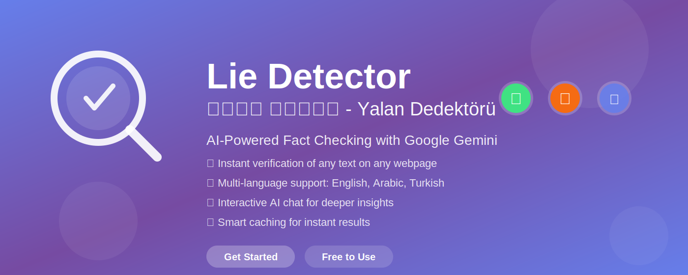
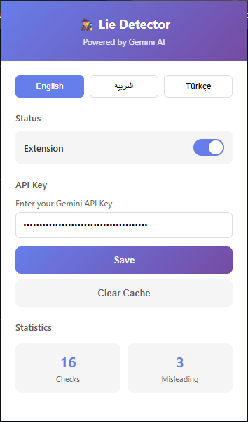

# 🔍 Lie Detector - Chrome Extension

**AI-powered lie detection extension that helps you verify information in real-time while browsing the web using Google's Gemini AI.**

[English](#english) | [العربية](#arabic)

---

## 🌟 Features

- ✅ **Smart Text Selection** - Select any text (15-500 words) or click on paragraphs to check
- 🤖 **Powered by Gemini AI** - Uses Google's Gemini 2.5 Pro & Flash models with Google Search integration
- 🎨 **Visual Indicators** - Color-coded badges (🟠 Checking, 🟢 Safe, 🔴 Warning)
- 💬 **Interactive Chat** - Continue conversation with Gemini about the checked content
- 🌍 **Multi-language Support** - English, Arabic (العربية), Turkish (Türkçe)
- 📊 **Statistics Tracking** - Monitor total checks and misleading content detected
- 💾 **Smart Caching** - Saves results to avoid re-checking the same content
- 🔒 **Privacy-Focused** - Your API key stays on your device

## 📥 Installation

### From Chrome Web Store (Recommended)
1. Visit the [Chrome Web Store](https://chrome.google.com/webstore/detail/mgplnfjlklhgekpngckpclfddjlmhbep)
2. Click "Add to Chrome"
3. Confirm by clicking "Add extension"

### From Source (Developer Mode)
1. Clone this repository or download the ZIP file
2. Open Chrome and navigate to `chrome://extensions/`
3. Enable "Developer mode" (toggle in top-right corner)
4. Click "Load unpacked"
5. Select the `chrome-extension` folder

## 🚀 Getting Started

### Step 1: Get Your Gemini API Key
1. Visit [Google AI Studio](https://makersuite.google.com/app/apikey)
2. Sign in with your Google account
3. Create a new API key
4. Copy the key

### Step 2: Configure the Extension
1. Click the extension icon in your Chrome toolbar
2. Paste your Gemini API key
3. Click "Save"

### Step 3: Start Lie Detection

1. Select any text (15-500 words) on any webpage
2. Click the purple "🔍 Do you want to verify this information?" button
3. Wait for the analysis (indicator appears: 🟠 → 🟢/🔴)
4. Click the indicator to see detailed results

**Chat Feature:**
- Click any indicator to open the modal
- View the AI analysis report
- Copy the report with one click
- Ask follow-up questions in the chat box
- Get instant answers from Gemini AI

## 🎨 Visual Indicators

| Icon | Status | Description |
|------|--------|-------------|
| 🔄 **Spinner** | Checking | Analysis in progress |
| ✓ **Green Badge** | Safe | No misinformation detected |
| ⚠️ **Red Badge (Blinking)** | Warning | Potential misinformation found |
| ? **Gray Badge** | Error | Analysis failed (check API key) |

## 📸 Screenshots

*Configure your API key through the simple popup interface*

*Real-time indicators appear on web content*

*Interactive chat with Gemini AI for detailed analysis*

## 🛠️ Technical Details

- **Manifest Version**: 3
- **Permissions**: activeTab, storage
- **AI Models**: Gemini 2.5 Pro (primary), Gemini 2.5 Flash (fallback)
- **AI Features**: Google Search integration for fact-checking
- **Text Range**: 15-500 words per check
- **Languages**: English, Arabic, Turkish (auto-detection)
- **Caching**: Local storage for checked content
- **Supported Browsers**: Chrome, Edge, Brave (Chromium-based)

## 🗺️ Roadmap

- [ ] More language support (French, Spanish, German, etc.)
- [ ] Batch lie detection for entire pages
- [ ] Source citation and reference links in reports
- [ ] Customizable word count limits
- [ ] Export reports as PDF/JSON
- [ ] Browser history of all checked content
- [ ] Integration with other AI models (Claude, GPT)
- [ ] Mobile browser support (Firefox, Safari)
- [ ] Collaborative features (share findings)
- [ ] Developer API for integration
- [ ] Dark mode support
- [ ] Keyboard shortcuts

## 🤝 Feedback & Support

We're actively developing this extension and would love to hear from you!

**📧 Email**: [tahaalhriri@gmail.com](mailto:tahaalhriri@gmail.com)  
**📱 WhatsApp**: [+905349338283](https://wa.me/905349338283)

### Help Us Improve
- 🐛 Report bugs or issues
- 💡 Suggest new features
- ⭐ Rate us on the Chrome Web Store
- 🔄 Share with friends and colleagues

## 💖 Support This Project

If you find this extension useful, please consider:

- ⭐ **Star this repository** on GitHub
- 📢 **Share** with your network
- 💬 **Leave a review** on the Chrome Web Store
- 🤝 **Contribute** to the codebase

Your support helps us continue building free, open-source tools for everyone!

## 📄 License

This project is open source and available under the [MIT License](LICENSE).

## 🙏 Acknowledgments

- Powered by [Google Gemini AI](https://deepmind.google/technologies/gemini/)
- Special thanks to the **Tech Pioneers Community** (مجتمع رواد التكنولوجيا)
  - 🌐 [Website](https://techec.org/)
  - 📘 [Facebook](https://www.facebook.com/people/%D9%85%D8%AC%D8%AA%D9%85%D8%B9-%D8%B1%D9%88%D8%A7%D8%AF-%D8%A7%D9%84%D8%AA%D9%83%D9%86%D9%88%D9%84%D9%88%D8%AC%D9%8A%D8%A7/61570981104832/)
  - 📸 [Instagram](https://www.instagram.com/tech_e_c/)
  - 💼 [LinkedIn](https://www.linkedin.com/company/technology-entrepreneurs-community/)
  - 👥 Join us to connect with tech entrepreneurs and innovators!
- Built with ❤️ for the open-source community

---

# 🔍 كاشف الهبد - إضافة Chrome

**إضافة لكشف الأكاذيب مدعومة بالذكاء الاصطناعي تساعدك على التحقق من المعلومات في الوقت الفعلي أثناء تصفح الويب باستخدام Gemini AI من Google.**

## 🌟 المميزات

- ✅ **اختيار النص الذكي** - حدد أي نص (15-500 كلمة) للفحص
- 🤖 **مدعوم بـ Gemini AI** - يستخدم نماذج Gemini 2.5 Pro و Flash مع تكامل بحث Google
- 🎨 **مؤشرات بصرية** - شارات ملونة (🟠 جاري الفحص، 🟢 آمن، 🔴 تحذير)
- 💬 **محادثة تفاعلية** - تابع المحادثة مع Gemini حول المحتوى المفحوص
- 🌍 **دعم متعدد اللغات** - الإنجليزية، العربية، التركية
- 📊 **تتبع الإحصائيات** - راقب إجمالي الفحوصات والمحتوى المضلل المكتشف
- 💾 **ذاكرة تخزين ذكية** - حفظ النتائج لتجنب إعادة فحص نفس المحتوى
- 🔒 **يحترم الخصوصية** - مفتاح API الخاص بك يبقى على جهازك

## 📥 التثبيت

### من متجر Chrome (موصى به)
1. قم بزيارة [متجر Chrome](https://chrome.google.com/webstore/detail/mgplnfjlklhgekpngckpclfddjlmhbep)
2. اضغط على "إضافة إلى Chrome"
3. أكد بالضغط على "إضافة الإضافة"

### من المصدر (وضع المطور)
1. استنسخ هذا المستودع أو قم بتنزيل ملف ZIP
2. افتح Chrome واذهب إلى `chrome://extensions/`
3. فعّل "وضع المطور" (المفتاح في الزاوية العلوية اليمنى)
4. اضغط على "تحميل إضافة غير معبأة"
5. اختر مجلد `chrome-extension`

## 🚀 البدء

### الخطوة 1: احصل على مفتاح Gemini API
1. قم بزيارة [Google AI Studio](https://makersuite.google.com/app/apikey)
2. سجل الدخول بحساب Google الخاص بك
3. أنشئ مفتاح API جديد
4. انسخ المفتاح

### الخطوة 2: إعداد الإضافة
1. اضغط على أيقونة الإضافة في شريط أدوات Chrome
2. الصق مفتاح Gemini API الخاص بك
3. اضغط على "حفظ"

### الخطوة 3: ابدأ كشف الأكاذيب

1. حدد أي نص (15-500 كلمة) على أي صفحة ويب
2. اضغط على الزر البنفسجي "🔍 هل تريد التأكد من هذه المعلومات؟"
3. انتظر التحليل (يظهر المؤشر: 🟠 → 🟢/🔴)
4. اضغط على المؤشر لرؤية النتائج التفصيلية

**ميزة المحادثة:**
- اضغط على أي مؤشر لفتح النافذة
- اعرض تقرير تحليل الذكاء الاصطناعي
- انسخ التقرير بنقرة واحدة
- اطرح أسئلة متابعة في صندوق الدردشة
- احصل على إجابات فورية من Gemini AI

## 🎨 المؤشرات البصرية

| الأيقونة | الحالة | الوصف |
|----------|--------|-------|
| 🔄 **دوران** | جاري الفحص | التحليل قيد التنفيذ |
| ✓ **شارة خضراء** | آمن | لم يتم اكتشاف معلومات مضللة |
| ⚠️ **شارة حمراء (وميض)** | تحذير | تم العثور على معلومات مضللة محتملة |
| ? **شارة رمادية** | خطأ | فشل التحليل (تحقق من مفتاح API) |

## 📸 لقطات الشاشة

*قم بتكوين مفتاح API الخاص بك من خلال واجهة بسيطة*

*تظهر المؤشرات في الوقت الفعلي على محتوى الويب*

*محادثة تفاعلية مع Gemini AI للتحليل التفصيلي*

## 🛠️ التفاصيل التقنية

- **إصدار Manifest**: 3
- **الأذونات**: activeTab, storage
- **نماذج الذكاء الاصطناعي**: Gemini 2.5 Pro (أساسي)، Gemini 2.5 Flash (احتياطي)
- **ميزات الذكاء الاصطناعي**: تكامل بحث Google للتحقق من الحقائق
- **نطاق النص**: 15-500 كلمة لكل فحص
- **اللغات**: الإنجليزية، العربية، التركية (كشف تلقائي)
- **التخزين المؤقت**: التخزين المحلي للمحتوى المفحوص
- **المتصفحات المدعومة**: Chrome, Edge, Brave (المستندة إلى Chromium)

## 🗺️ خارطة الطريق المستقبلية

- [ ] دعم المزيد من اللغات (الفرنسية، الإسبانية، الألمانية، إلخ)
- [ ] كشف الأكاذيب الجماعي للصفحات بأكملها
- [ ] الاستشهاد بالمصادر وروابط المراجع في التقارير
- [ ] حدود عدد الكلمات القابلة للتخصيص
- [ ] تصدير التقارير بصيغة PDF/JSON
- [ ] سجل المتصفح لجميع المحتوى المفحوص
- [ ] التكامل مع نماذج ذكاء اصطناعي أخرى (Claude، GPT)
- [ ] دعم متصفحات الهاتف المحمول (Firefox، Safari)
- [ ] ميزات تعاونية (مشاركة النتائج)
- [ ] واجهة برمجية للمطورين للتكامل
- [ ] دعم الوضع الداكن
- [ ] اختصارات لوحة المفاتيح

## 🤝 الملاحظات والدعم

نحن نطور هذه الإضافة بنشاط ونود أن نسمع منك!

**📧 البريد الإلكتروني**: [tahaalhriri@gmail.com](mailto:tahaalhriri@gmail.com)  
**📱 واتساب**: [+905349338283](https://wa.me/905349338283)

### ساعدنا على التحسين
- 🐛 أبلغ عن الأخطاء أو المشاكل
- 💡 اقترح ميزات جديدة
- ⭐ قيمنا على متجر Chrome
- 🔄 شارك مع الأصدقاء والزملاء

## 💖 ادعم هذا المشروع

إذا وجدت هذه الإضافة مفيدة، يرجى النظر في:

- ⭐ **ضع نجمة** لهذا المستودع على GitHub
- 📢 **شارك** مع شبكتك
- 💬 **اترك تقييماً** على متجر Chrome
- 🤝 **ساهم** في الكود البرمجي

دعمك يساعدنا على الاستمرار في بناء أدوات مجانية ومفتوحة المصدر للجميع!

## 📄 الترخيص

هذا المشروع مفتوح المصدر ومتاح بموجب [ترخيص MIT](LICENSE).

## 🙏 شكر وتقدير

- مدعوم بواسطة [Google Gemini AI](https://deepmind.google/technologies/gemini/)
- شكر خاص لـ **مجتمع رواد التكنولوجيا**
  - 🌐 [الموقع الإلكتروني](https://techec.org/)
  - 📘 [فيسبوك](https://www.facebook.com/people/%D9%85%D8%AC%D8%AA%D9%85%D8%B9-%D8%B1%D9%88%D8%A7%D8%AF-%D8%A7%D9%84%D8%AA%D9%83%D9%86%D9%88%D9%84%D9%88%D8%AC%D9%8A%D8%A7/61570981104832/)
  - 📸 [إنستغرام](https://www.instagram.com/tech_e_c/)
  - 💼 [لينكد إن](https://www.linkedin.com/company/technology-entrepreneurs-community/)
  - 👥 انضم إلينا للتواصل مع رواد الأعمال والمبتكرين في مجال التكنولوجيا!
- تم البناء بـ ❤️ لمجتمع المصادر المفتوحة

---

**Made with ❤️ for a better, more informed internet**
